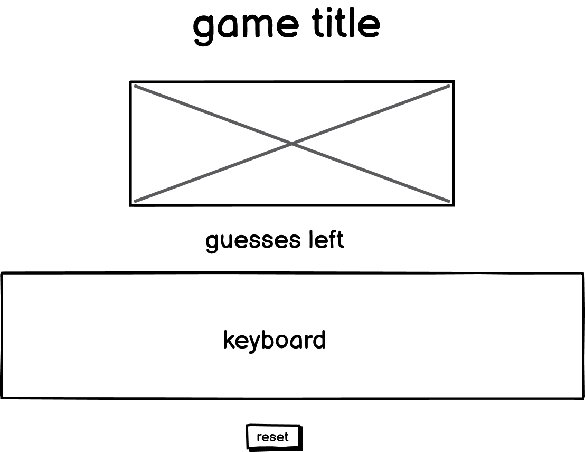
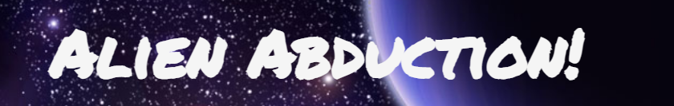
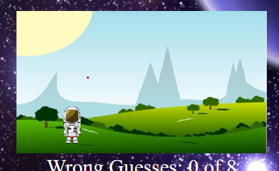
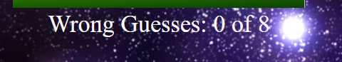
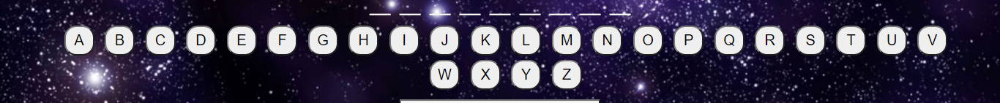
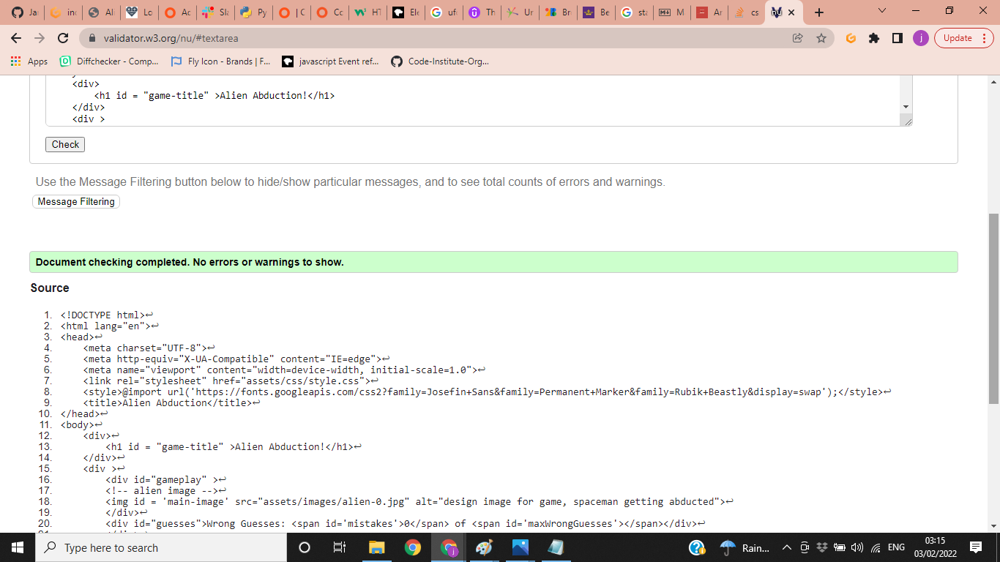
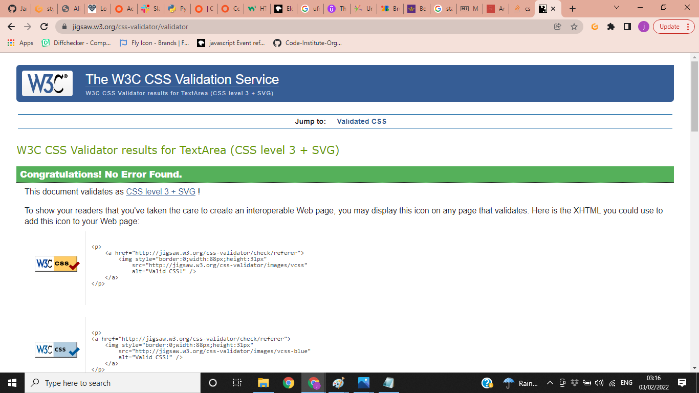
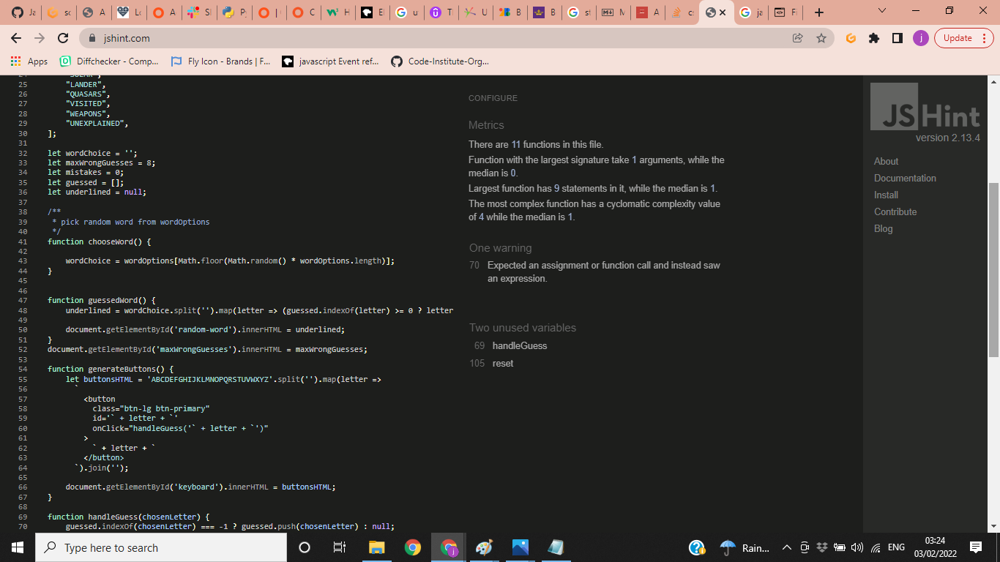
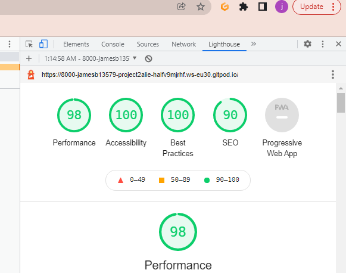

# Project Two: Alien Abduction game

I created this game as a new version of hangman. One that is more in tune with modern society.

The aim for the game is for people to be able to enjoy guessing words based around alien abduction. With simple animations to keep people attention.

View live site: https://jamesb13579.github.io/project2-alienabduction/

## Table Of Contents

  * [User Stories](#user-stories) 
  * [Design](#design)
  * [Features](#features)
  * [Technologies used](#technologies-used)
  * [Testing](#testing)
  * [Deployment and Cloning](#deployment-and-cloning)
  * [Credits](#credits)
---

## User Stories
__As a new user__

- I would be like to be able to easily navigate the game.
- I would like to be able to be able to play intuitively.

__As an existing user__

- I would like to see regular updates to the word to be guessed, so the game doesnt get boring to quickly.
- I would like to be able to access this website on the go, so good mobile responsiveness is important.

## Design
__Theme__

As I was making a game about aliens I wanted to imagery and fonts to be suitable. The font that I used is __Josefin Sans__ and __Perminent Marker__. I felt this suited the style of game I was trying to create, the font is available from [google fonts](https://https://fonts.google.com/).

__Color Scheme__

The color scheme was chosen using a complimentry color generator, which I play with until I found the options that seemed right to me.

__Photos and Icons__

I created images suitiable to the game using paint

__Wireframes__

For this project I created one wireframe for how I wanted the game to look. I did change things as I built the game, as trial and error changed how I liked it.

## Features

__Title__

The title for this game is a H1 heading.

__Main Image__

The main image is centered on the page. I created 8 images using paint having the spaceship move incredimentally across the page as the game progesses.

__Guesses Left__

This section shows how many guesses left a player of the game has out of 8.

__Keyboard__

This section contains the on screen keyboard. This keyboard also changes to a win or loss message depending on the outcome of the game.

## Technologies used

- HTML5: Used to make the structure and content of the game
- CSS3: Used to style the game content and appearance
- JAVASCRIPT: Used to make the game interactive
- GITPOD: Used to code the game
- GITHUB: Used to store, deploy and host the game
- Balsamiq Wireframes: Used to draft page design and layout

## Testing

I used Dev tools in chrome constantly during the development of my code to try and fix the style and catch any issues, I committed and detailed as much as possible of the changes made to my code. 

__Validator Testing__

HTML: No errors reported

CSS: No errors reported

JAVASCRIPT: No errors reported

__Lighthouse__
Desktop

__Bugs & Fixes__
One warning on jshint.
I had some issues with the game with JAVASCRIPT but i thing i have most of them sorted.

## Deployment and Cloning

__Deployment__

The website was deployed to github pages using the following steps:
- Clicked on my repository for first-project. 
- Clicked settings tab and navigated down to "Pages"
- Selected "Main" in branch drop down box
- Clicked "save" which produced the live link which can be viewed here https://jamesb13579.github.io/project2-alienabduction/

__Cloning__

In the File menu, click Clone Repository.
- Click the tab that corresponds to the location of the first-project repository.
- Choose the first-project repository from the list of options to clone.
- Click choose and navigate to a local path where you want to clone the repository.
- Click Clone.

## Credits

__Tools & Media__

- Fonts used supplied by [Google Fonts](https://https://fonts.google.com/)
- Images used were created by me.
- Color scheme created using the website [Colormind](http://colormind.io/)
- Images used in this document were screen shot from validators and amiresponsive.
- Converted images with [Cloud Convert](https://cloudconvert.com/)

__Code and Tutorials__

- Learnt how to build onscreen keyboard through youtube tutorials.
- W3schools also helped with me learn extra about more about javascript.
- Learnt more about javascript with a course from [Udemy](https://www.udemy.com/)
- Learnt how to make a [Favicon](https://www.youtube.com/watch?v=kEf1xSwX5D8) 