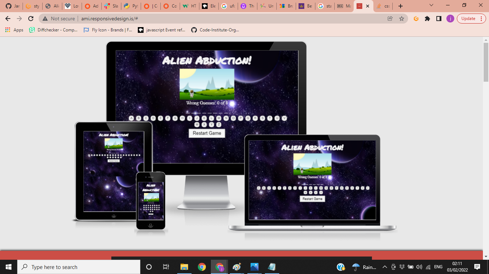

# Project Two: Alien Abduction game

I created this game as a new version of hangman. One that is more in tune with modern society.

The aim for the game is for people to be able to enjoy guessing words based around alien abduction. With simple animations to keep people attention.

View live site: https://jamesb13579.github.io/project2-alienabduction/

## Table Of Contents

  * [User Stories](#user-stories) 
  * [Design](#design)
  * [Features](#features)
  * [Technologies used](#technologies-used)
  * [Testing](#testing)
  * [Deployment and Cloning](#deployment-and-cloning)
  * [Credits](#credits)
---

## User Stories
__As a new user__

- I would be like to be able to easily navigate the game.
- I would like to be able to be able to play intuitively.

__As an existing user__

- I would like to see regular updates to the word to be guessed, so the game doesnt get boring to quickly.
- I would like to be able to access this website on the go, so good mobile responsiveness is important.

## Design
__Theme__

As I was making a game about aliens I wanted to imagery and fonts to be suitable. The font that I used is __Josefin Sans__. I felt this suited the style of game I was trying to create, the font is available from [google fonts](https://https://fonts.google.com/).

__Color Scheme__

The color scheme was chosen using a complimentry color generator, which I play with until I found the options that seemed right to me.

__Photos and Icons__

I created images suitiable to the game using paint

__Wireframes__

For this project I created one wireframe for how I wanted the game to look. I did change things as I built the game, as trial and error changed how I liked it.

## Features

__Header__

In the Header I have included the authors logo, and underneath that placed the nav bar and linked all his social media.

__Navigation__

The navigation menu bar is on the top left of the home page and is an easy way for the user to navigate to their sought after section within the site. To provide users with an introduction to what they can expect to discover on the website, each menu option has been named accordingly to link to its corresponding section. Also included in this section are links to the authors Amazon, Goodreads, Facebook and Twitter profiles.

__Home Page__

The home page has a background image that I have cropped from the front cover of one Frank Tayells books. The image gives the user an idea of the genre of his work.

__About Author__

The about author section was supposed to include an image of the author, plus additional information about the author, and the books and series he is working on. Unfortunately, when I was speaking to the author he said he prefers to be judged on his work rather than appearance so I used an image that he uses on his goodreads and amazon instead.

__Books__

The books page shows all of the authors current books split into series, divided with section titles and ordered into release date. The images are all links to the correct Amazon sales page.

__Subscribe__

The user can subscribe to the authors newsletter as they submit. The user must enter their e-mail address into the input fields for the form to submit. There are prompt messages that appear when this information is not correctly inputted. Currently this goes to code institute file dump.

__Message the author__

This section is there to enable direct interaction with the author. Requesting first name, surname, email and message details the user can then submit these details. Again there is a prompt message if information is incorrectly inputted. Currently this goes to code institute file dump.

__Hover__

Each clickable element on the website changes color and/or underlines when hovered over with the mouse. Aswell as this I have applied a zoom animation to the book elements when they are hovered over to a scale of 1.05.

__Footer__

In the footer I have included a copyright for the authors images as he asked for that to be included and again, linked all his social media.

## Technologies used

- HTML5: Used to make the structure and content of the game
- CSS3: Used to style the game content and appearance
- JAVASCRIPT: Used to make the game interactive
- GITPOD: Used to code the game
- GITHUB: Used to store, deploy and host the game
- Balsamiq Wireframes: Used to draft page design and layout

## Testing

I used Dev tools in chrome constantly during the development of my code to try and fix the style and catch any issues, I committed and detailed as much as possible of the changes made to my code. 

__Validator Testing__

HTML: No errors reported

CSS: No errors reported

JAVASCRIPT: No errors reported

__Lighthouse__
Mobile

Desktop

__Bugs & Fixes__
No Bugs at time of deployment.
I had some issues with the game with JAVASCRIPT but i thing i have most of them sorted.

## Deployment and Cloning

__Deployment__

The website was deployed to github pages using the following steps:
- Clicked on my repository for first-project. 
- Clicked settings tab and navigated down to "Pages"
- Selected "Main" in branch drop down box
- Clicked "save" which produced the live link which can be viewed here https://jamesb13579.github.io/project2-alienabduction/

__Cloning__

In the File menu, click Clone Repository.
- Click the tab that corresponds to the location of the first-project repository.
- Choose the first-project repository from the list of options to clone.
- Click choose and navigate to a local path where you want to clone the repository.
- Click Clone.

## Credits

__Tools & Media__

- Fonts used supplied by [Google Fonts](https://https://fonts.google.com/)
- Images used were created by me.
- Color scheme created using the website [Colormind](http://colormind.io/)
- Images used in this document were screen shot from validators and amiresponsive.
- Converted images with [Cloud Convert](https://cloudconvert.com/)

__Code and Tutorials__

- Learnt how to build onscreen keyboard through youtube tutorials.
- W3schools also helped with me learn extra about more about javascript.
- Learnt more about javascript with a course from [Udemy](https://www.udemy.com/)
- Learnt how to make a [Favicon](https://www.youtube.com/watch?v=kEf1xSwX5D8) 